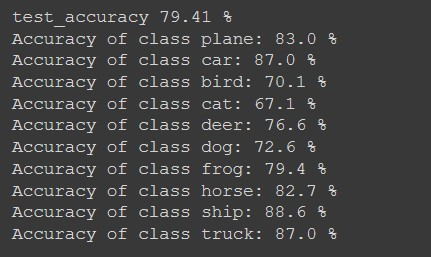
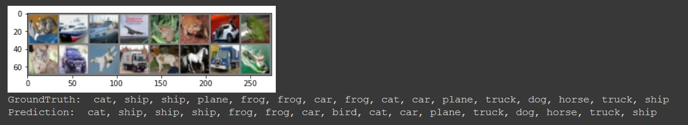

# Pytorch-Image-Classifier
- Designed a custom model using Pytorch Framework to identify images in CIFAR10 dataset.
- Loaded and normalized the CIFAR10 training and test datasets using torchvision.
- Defined a Convolutional Neural Network, a loss function and optimizer after iterating through various models and hyper parameters for achieving maximum accuracy.
- Trained the network on the training data using custom build training loop.
- Evaluated the network and acquired the accuracy of about 80% on the test data as well as obtained accuracy for each class also.

Overall accuracy and accuracy for each class as well as prediction on some test images are shown below:

The colab notebook for this project can be found [here] or in this [google drive link].
